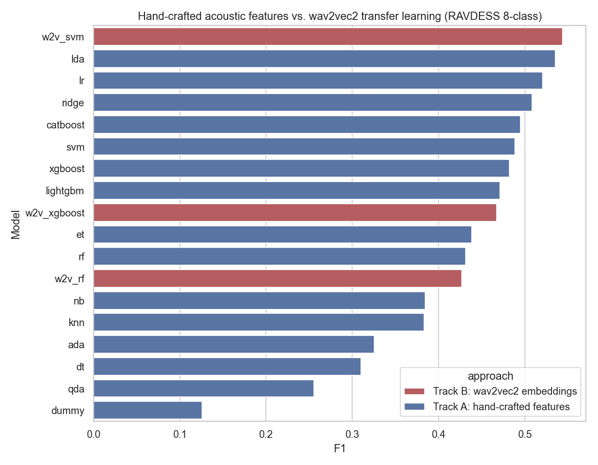
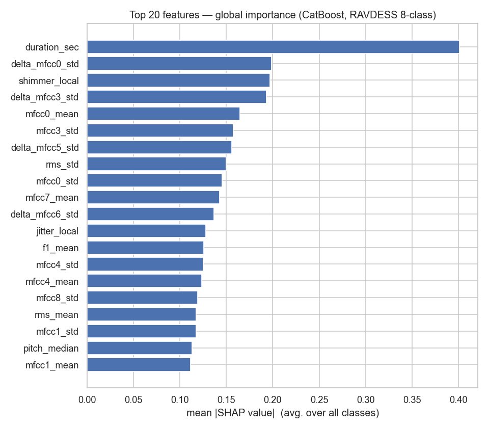

# Interpretable Speech Emotion Recognition (SER)

> Two ways to teach a model to hear emotion in a voice — hand-engineered acoustic
> features vs. a pretrained transformer — and, more importantly, **explaining
> why it decides what it decides**, using SHAP.

---

## 🎯 Overview

My research at the Weizmann Institute asked a specific question about **real,
spontaneous stress**: using SHAP on authentic 911 emergency-call audio, which
acoustic features actually predict vocal stress, and can we trust the
explanation? That lab dataset isn't publicly redistributable, so this repo
**reproduces the same end-to-end methodology on a fully public dataset**
([RAVDESS](https://zenodo.org/records/1188976)) — feature extraction, model
comparison, and SHAP interpretability — so anyone can clone it and run the
whole pipeline themselves.

Along the way it also asks a second, practical question: for this task, does a
pretrained speech transformer (**wav2vec2**) beat carefully hand-engineered
acoustic features, or is domain feature engineering still competitive?

**Two tracks, one question each:**
- **Track A** — classic ML on ~80 hand-crafted acoustic-prosodic features, explained with SHAP.
- **Track B** — frozen `wav2vec2` embeddings (transfer learning) vs. Track A, head-to-head.

## 📊 Key results

| | Best model | F1 (macro) | Notebook |
|---|---|---|---|
| **Track A** — hand-crafted features | LDA | 0.536 | [`03_modeling`](notebooks/03_modeling.ipynb) |
| **Track B** — wav2vec2 embeddings | SVM | **0.544** | [`05_wav2vec_transfer_learning`](notebooks/05_wav2vec_transfer_learning.ipynb) |

wav2vec2 wins — **by under 1%.** For this dataset and task, a 95M-parameter
transformer barely edges out ~80 features computed with `librosa` and Praat, at
a fraction of the compute cost. A real engineering trade-off, not a foregone
conclusion:



**What actually drives the predictions?** SHAP on the Track A model
(CatBoost, evaluated on entirely held-out speakers) found **clip duration**
as the single strongest predictor — well ahead of any spectral or MFCC feature:



This is a genuinely interesting contrast with the original 911-call research
(where delta-MFCCs and spectral contrast dominated instead): RAVDESS is
**acted** speech, and actors often convey emotion partly through deliberate
*pacing* (fast for anger/fear, slow for sadness/calm) — a coarser signal than
the subtle spectral patterns that mark real, spontaneous stress. See
[`04_interpretability`](notebooks/04_interpretability.ipynb) for the full
breakdown, including a per-class SHAP beeswarm and a single-clip explanation.

## 🧠 Methods

- **[`01_data_exploration`](notebooks/01_data_exploration.ipynb)** — load RAVDESS, decode labels, EDA (class balance, waveform/spectrogram).
- **[`02_feature_extraction`](notebooks/02_feature_extraction.ipynb)** — ~80 features: intensity, pitch, MFCCs (+ deltas), spectral shape (`librosa`), formants/jitter/shimmer (`parselmouth`/Praat).
- **[`03_modeling`](notebooks/03_modeling.ipynb)** — 14 classifiers compared via `GroupKFold` grouped by **actor** (not a random split) — no speaker leakage between train and validation.
- **[`04_interpretability`](notebooks/04_interpretability.ipynb)** — exact SHAP (`TreeExplainer`) on CatBoost, evaluated on 5 entirely held-out actors.
- **[`05_wav2vec_transfer_learning`](notebooks/05_wav2vec_transfer_learning.ipynb)** — frozen `facebook/wav2vec2-base` embeddings + classical classifiers, same actor-held-out evaluation, compared directly against Track A.

## 📁 Project structure

```
interpretable-ser/
├── data/
│   └── download_ravdess.py   downloads the public RAVDESS corpus (not committed — run this first)
├── notebooks/                01 → 05, run in order
├── figures/                  plots generated by the notebooks (used in this README)
└── src/, app/                reserved for future work (see below)
```

## ⚙️ How to run

```bash
pip install -r requirements.txt
python data/download_ravdess.py        # downloads ~1,440 public audio clips
jupyter lab                             # open notebooks/01 through 05, in order
```

Each notebook writes its outputs (features, model results, figures) to `data/`
and `figures/`, which later notebooks read back in.

## 📚 Data

- **[RAVDESS](https://zenodo.org/records/1188976)** (CC BY-NC-SA) — 24 actors,
  8 emotions, 1,440 clips. The only dataset actually used in this repo,
  downloaded automatically by `data/download_ravdess.py`.
- **911 emergency-call audio** — the motivating dataset from my original
  research; not used directly in this repo (the emotion annotations are lab
  IP, not public), but the reason this project exists and the source of the
  "acted vs. authentic emotion" question it explores.

## 🔭 Not yet built

- **Track C-ish demo:** a live Gradio app (upload audio → prediction +
  explanation), deployed to HuggingFace Spaces. `app/` is reserved for this.
- Fine-tuning wav2vec2 end-to-end (Track B currently uses it as a **frozen**
  feature extractor only — no gradient updates to the transformer itself).

## 👩‍💻 Author

**Miriam Elbaz** — Data Scientist · M.Sc. Computational Biology (Weizmann Institute of Science)
[GitHub](https://github.com/mir1998) · [LinkedIn](https://www.linkedin.com/in/miriam-elbaz) · [Google Scholar](https://scholar.google.com/citations?user=T0gaq5gAAAAJ)
